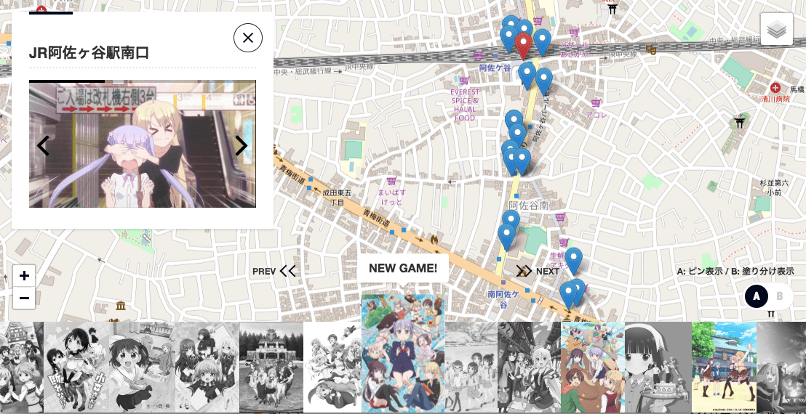

# hobunsha-map

WebGIS for visit the real-life locations on "Houbunsha" works

## Content Page

<a href="https://hirosaji.github.io/hobunsha-map/public/"></a>
<p>https://hirosaji.github.io/hobunsha-map/public/</p>

## Development

### Setup

```
npm install
```

### Local Run

You can run code on your local machine by:

```
npm run server
```
